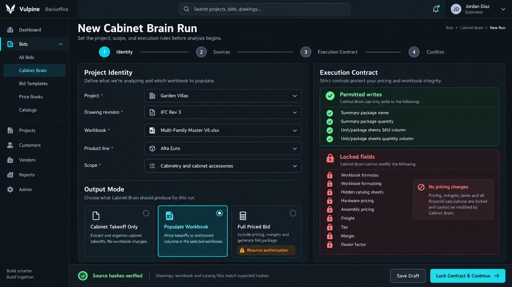
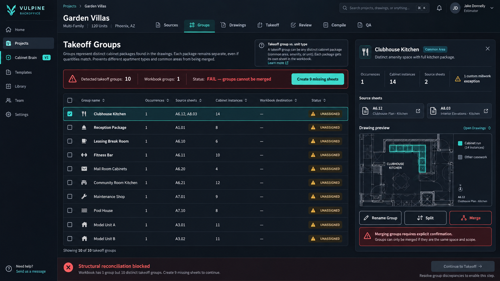
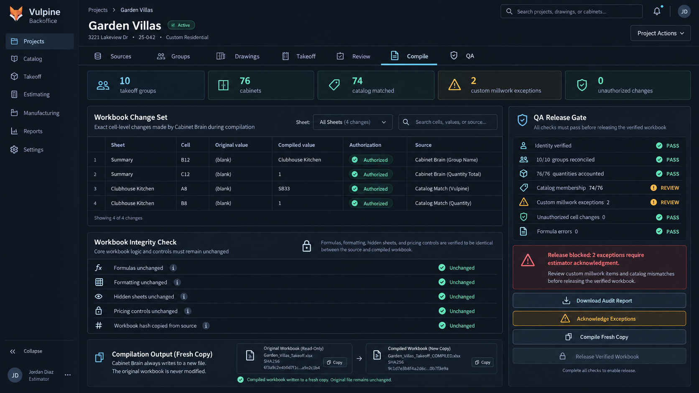

# Cabinet Brain Product Blueprint

**Status:** Product and implementation directive

**Audience:** Vulpine ownership, estimators, product design, engineering, QA, and operations

**Applies to:** Vulpine Backoffice, Vulpine Vision, Auto Bid Engine, workbook compilation, and cabinet-estimating workflows

**Primary product:** Cabinet Brain V1

**Last updated:** 2026-09-25

---

## 1. Executive decision

Vulpine is not building a generic PDF chatbot, a generic construction estimator, or a dashboard that happens to display numbers extracted from plans.

Vulpine is building a controlled cabinet-estimating compiler.

The system must take construction drawings and an approved cabinet workbook, preserve the real structure of the project, produce evidence-backed cabinet instances, resolve only catalog-valid SKUs, and compile the approved result into a fresh copy of the workbook without changing anything the user did not authorize.

The product is divided into three explicit systems:

1. **Cabinet Brain** owns scope structure, cabinet classification, normalized dimensions, SKU resolution, quantities, exceptions, review state, compilation instructions, and QA.
2. **Vulpine Vision** reads drawings and produces source evidence for Cabinet Brain. It does not own pricing, approval, or workbook mutation.
3. **Bid Engine** optionally applies pricing, freight, hardware, tax, build, margin, and proposal rules after the cabinet takeoff has been verified and only when the selected execution mode authorizes those actions.

For V1, **Cabinet Brain is the product**. Vision is an evidence provider. Pricing is downstream and optional.

The north-star statement is:

> **Cabinet Brain converts construction drawings into a verified, evidence-backed, SKU-level cabinet takeoff and safely compiles it into Vulpine's approved workbook.**

This statement is narrower than “autonomous estimator” on purpose. The first production obligation is correctness, traceability, and workbook safety—not maximum automation.

---

## 2. Why the plan changed

The prior architecture was directionally correct. It properly separated deterministic document processing from selective multimodal reasoning, required provenance, treated AI as a component rather than the whole system, and placed review and QA before proposal generation.

The new directive exposes two failure classes that require a stronger product boundary.

### 2.1 Unauthorized workbook changes

A system can extract every cabinet correctly and still fail the business if it changes freight, hardware, tax, margin, dealer factor, formulas, formatting, or hidden workbook logic without permission.

Therefore, every run must begin with an immutable execution contract defining:

- the requested output mode;
- the exact source drawing revision;
- the exact workbook version and hash;
- the product line and scope;
- cells or named regions that may be modified;
- workbook elements that must remain identical;
- the authorization required to expand the mutation boundary.

### 2.2 Structural aggregation errors

The estimating unit cannot always be called a unit type. A project may contain repeating apartments, one-off clubhouses, reception desks, break rooms, bars, common-area kitchens, model units, mailbox packages, and custom millwork.

Garden Villas demonstrated why this matters: ten distinct common-area packages were aggregated into one workbook unit. The final cabinet total may remain numerically unchanged while the workbook becomes structurally wrong and operationally unusable.

Cabinet Brain must therefore use **takeoff group** as its internal structural concept.

```text
Takeoff group
  -> occurrence count
  -> source sheets and regions
  -> cabinet instances
  -> workbook destination
  -> review and compilation state
```

Distinct groups may never be merged solely because their occurrence count, cabinet count, or SKU list happens to match.

---

## 3. Old plan versus revised plan

| Area | Earlier direction | Revised Cabinet Brain direction |
| --- | --- | --- |
| Product center | Vision-led plan analysis and bid generation | Cabinet Brain-led takeoff compilation with Vision as an evidence supplier |
| First milestone | Plans to SKU takeoff to priced proposal | Identity gate to takeoff groups to verified SKUs to guarded workbook compilation |
| Pricing | Core stage of the V1 pipeline | Optional execution mode downstream of verified takeoff |
| Workbook authority | Source for catalog/pricing and eventual export | Operational authority for V1; compiled into a fresh copy with a cell-level mutation manifest |
| Structural unit | Apartment unit type | Takeoff group: apartment, room, amenity, common-area package, unique package, or other independently estimated scope |
| Scope control | Project-level workflow state | Immutable per-run execution contract with permitted and forbidden writes |
| Custom millwork | Potentially mapped through broad cabinet taxonomy | Explicit exception class; never coerced into an unrelated catalog SKU |
| Confidence | Composite system score | Calibrated, evidence-derived score with no raw model confidence treated as truth |
| QA focus | Counts, mappings, pricing, and release readiness | Identity, structure, catalog validity, quantities, mutation authorization, workbook integrity, and then optional pricing |
| Release artifact | Bid package | Verified takeoff or compiled workbook first; priced bid only in explicitly authorized mode |
| Product success | High automated completion | Safe, explainable, reviewer-efficient completion with zero unauthorized mutations |

The previous plan is not discarded. Its document compiler, sheet classification, region detection, evidence model, selective AI, review queue, deterministic rules, and audit requirements remain. The build order and authority model change.

---

## 4. Product boundaries

### 4.1 Cabinet Brain owns

- Run identity and execution contract
- Source manifest and hashes
- Takeoff-group discovery and reconciliation
- Cabinet-family classification
- Observed and normalized dimensions
- Catalog-constrained SKU resolution
- Cabinet quantities and repetition
- Supported-cabinet versus custom-millwork classification
- Exceptions and reviewer decisions
- Workbook destination mapping
- Mutation manifest
- QA state and release eligibility
- Audit trail

### 4.2 Vulpine Vision owns

- PDF and drawing ingestion
- Page indexing
- Embedded text and coordinate extraction
- Vector and image inspection
- Sheet-number and title-block extraction
- Sheet classification and relevance ranking
- Region detection and crops
- OCR fallback
- Multimodal analysis through a provider abstraction
- Evidence artifacts and source coordinates

Vision outputs evidence and hypotheses. It does not declare a workbook safe, approve a takeoff, or invent a SKU.

### 4.3 Bid Engine owns

- Optional price resolution from the authorized workbook snapshot
- Hardware, build, assembly, freight, tax, markup, commission, allowances, and overrides when authorized
- Immutable pricing versions
- Margin and commercial QA
- Proposal assembly and export

Cabinet Brain can function without Bid Engine pricing. A takeoff-only run must never be forced through commercial fields.

### 4.4 Explicit non-goals for V1

- Autonomous customer delivery
- Automatic customer email
- Full general-contractor estimating
- Unrelated trades such as electrical, plumbing, structural, civil, or landscaping
- Replacement of the approved Excel workbook calculation engine
- Silent repricing
- Fabrication/shop-drawing automation
- Invented cabinets or invented catalog SKUs
- Treating custom architectural millwork as a standard cabinet
- Using model confidence as final approval
- A separate standalone Vision application

---

## 5. Core operating principles

### 5.1 The request controls scope

Drawings, specifications, RFIs, schedules, and workbook notes are evidence. They do not automatically expand the requested scope. The execution contract determines whether the run is takeoff-only, workbook-fill, or full priced bid.

### 5.2 Project identity is a hard gate

The system must confirm project, drawing revision, workbook file, workbook hash, product line, and requested scope before analysis. If any source changes, the existing run is marked stale and a new source revision must be acknowledged.

### 5.3 Project structure precedes counting

Cabinet Brain identifies takeoff groups before generating project totals. Repetition is applied only after each group's identity and occurrence count are reviewed or reconciled.

### 5.4 Family precedes size, and size precedes SKU

The matching order is:

```text
cabinet family
  -> observed dimensions
  -> normalized dimensions
  -> product-line compatibility
  -> exact catalog rule
  -> approved alias or catalog search
  -> semantic fallback
  -> unresolved exception
```

A width match cannot override an incompatible cabinet family.

### 5.5 The catalog is a closed universe

Only records from the approved workbook/catalog snapshot can become catalog SKUs. AI may rank candidates but may not manufacture a new code.

### 5.6 The workbook is immutable input

Compilation always writes to a fresh copy. The original workbook remains byte-for-byte untouched. Every changed cell must exist in an authorized mutation manifest.

### 5.7 Uncertainty must remain visible

Unknown means unknown. Unsupported means exception. Missing means blocking or review-required. The system must never use zero, a fabricated SKU, or a generic replacement to make a screen appear complete.

### 5.8 Verified is a controlled state

“Verified” requires applicable evidence, structural reconciliation, catalog validity, authorized compilation, QA completion, and human approval. It is not a visual badge assigned because processing finished.

---

## 6. Execution modes

Every run selects exactly one mode.

### 6.1 Cabinet Takeoff Only

Produces:

- takeoff groups;
- group quantities;
- cabinet instances;
- normalized cabinet requirements;
- SKU proposals and mappings;
- exception queue;
- reviewed takeoff exports.

It does not modify a workbook or calculate a commercial bid.

### 6.2 Populate Workbook

Produces everything in Takeoff Only and writes approved group names, quantities, SKUs, and line quantities to a fresh copy of the selected workbook.

Default permitted fields are explicit mappings such as:

- summary package name;
- summary package quantity;
- group-sheet SKU column;
- group-sheet quantity column.

Default forbidden fields include:

- formulas;
- formatting;
- hidden sheets;
- workbook protection;
- validation rules;
- hardware pricing;
- assembly/build pricing;
- freight;
- tax;
- markup and margin;
- dealer factor;
- product-line configuration.

### 6.3 Full Priced Bid

Extends Populate Workbook only after explicit authorization. It may apply commercial inputs permitted by the selected pricing profile. The run must record who authorized the expanded boundary, when, and why.

Full Priced Bid is not the default.

---

## 7. Cabinet Brain execution contract

The contract is immutable after processing begins. A changed contract creates a new run revision.

```json
{
  "mode": "populate_workbook",
  "project_id": "...",
  "drawing_revision_id": "...",
  "drawing_manifest_hash": "sha256:...",
  "workbook_artifact_id": "...",
  "workbook_hash": "sha256:...",
  "catalog_snapshot_id": "...",
  "product_line": "Alta Euro",
  "scope": ["cabinetry", "cabinet_accessories"],
  "permitted_writes": [
    "summary.package_name",
    "summary.package_quantity",
    "group_sheet.sku",
    "group_sheet.quantity"
  ],
  "forbidden_writes": [
    "formula",
    "formatting",
    "hidden_sheet",
    "pricing_control",
    "tax",
    "freight",
    "margin",
    "dealer_factor"
  ],
  "locked_by": "authenticated-subject-id",
  "locked_at": "ISO-8601 timestamp"
}
```

The real contract schema belongs in `packages/contracts`. Browser-visible data may contain the contract and safe identity fields, but never provider credentials or integration secrets.

---

## 8. Source authority and precedence

The run source manifest contains:

- original filename;
- durable artifact identifier;
- MIME type;
- byte size;
- SHA-256 hash;
- upload actor and time;
- revision label;
- declared purpose;
- derived artifacts;
- superseded-by relationship.

Authority rules:

```text
Approved drawing revision = scope and geometric evidence
Approved workbook snapshot = catalog and workbook structure
Execution contract = authorized output and mutation boundary
Estimator decision = final approval of exceptions and release
```

A job-level uploaded workbook overrides the repository default for that run only. A corrupt job workbook must fail ingestion and must not silently fall back to a different source.

---

## 9. Takeoff-group model

A takeoff group represents an independently understood and independently compilable cabinet package.

Examples include:

- apartment unit type;
- apartment alternate;
- ADA variant;
- clubhouse kitchen;
- leasing break room;
- reception package;
- fitness bar;
- mail room cabinetry;
- model unit;
- building-specific variation;
- floor-specific variation;
- one-off common-area room.

Required fields:

```text
id
project_id
run_revision_id
name
group_type
occurrence_count
source_sheet_ids
source_region_ids
workbook_destination
structure_status
review_status
created_by
created_at
updated_at
```

Structural reconciliation compares:

- detected groups;
- user-declared groups;
- schedule groups;
- workbook group destinations;
- occurrence counts;
- duplicate or conflicting evidence.

Blocking conditions include:

- multiple distinct groups assigned to one destination without explicit aggregation authorization;
- a discovered group with no workbook destination in Populate Workbook mode;
- a workbook group with no drawing evidence unless marked intentionally manual;
- conflicting occurrence counts;
- missing project-level repetition data where totals are requested.

---

## 10. Evidence model

Every cabinet instance must be explainable without reopening the entire plan set manually.

Required provenance:

- source document and revision;
- sheet number and title;
- page number;
- takeoff group;
- room or region;
- bounding box or polygon;
- original extracted text;
- original measurement;
- rendered crop artifact;
- extraction method;
- cabinet-family hypothesis;
- dimension interpretation;
- normalization rule;
- proposed SKU and candidate list;
- catalog match rule;
- confidence components;
- reviewer decision and timestamp.

Evidence is append-only. Correcting a cabinet creates a new decision and supersedes the prior interpretation; it does not erase the original observation.

---

## 11. Supported cabinets and custom millwork

Cabinet Brain must distinguish catalog-supported cabinetry from architectural/custom millwork.

Typical supported families:

- base;
- drawer base;
- sink base;
- wall;
- tall/utility;
- pantry;
- vanity;
- trash cabinet;
- refrigerator or bridge cabinet;
- fillers, panels, skins, molding, toe kick, and catalog accessories.

Likely custom-millwork exceptions:

- curved bar fronts;
- custom reception desks;
- built-in media walls;
- mailbox assemblies;
- non-catalog decorative millwork;
- unusual panels or assemblies without an approved catalog equivalent.

Custom millwork must retain measured scope and evidence, but it cannot be assigned an imaginary standard SKU. It enters review with a reason such as `UNSUPPORTED_CUSTOM_MILLWORK`.

---

## 12. Processing pipeline

### Stage 1: Identity gate

Validate the project, revisions, workbook, catalog, product line, scope, and requested mode.

### Stage 2: Workbook introspection

Create a read-only structural model of sheets, hidden state, named ranges, formulas, validations, merged cells, formatting signatures, protected areas, catalog rows, and authorized write destinations.

### Stage 3: Drawing compilation

Extract embedded text with coordinates, page dimensions, vectors, images, bookmarks, and title-block metadata using deterministic processing.

### Stage 4: Sheet classification

Rank floor plans, unit matrices, enlarged plans, interior elevations, cabinet elevations, schedules, finish sheets, specifications, and RFIs. Do not spend multimodal inference on irrelevant sheets by default.

### Stage 5: Takeoff-group discovery

Identify repeating and unique scope packages, associate their sheets, determine occurrence counts, and reconcile them with workbook destinations.

### Stage 6: Region analysis

Identify rooms, elevations, schedules, legends, cabinet runs, and detail regions. Rasterize only regions requiring pixel or semantic analysis.

### Stage 7: Cabinet-instance extraction

Classify family first, then extract observed dimensions and quantity. Store all source evidence.

### Stage 8: Normalization

Apply versioned dimension rules while preserving original values. Normalization is deterministic and product-line aware.

### Stage 9: Catalog resolution

Resolve through exact rules, aliases, constrained catalog search, and finally semantic ranking. Invalid or unsupported candidates remain unresolved.

### Stage 10: Human review

Present low-confidence, conflicting, unsupported, and structurally ambiguous items with evidence. Reviewer decisions become append-only training/evaluation data.

### Stage 11: Deterministic aggregation

Aggregate approved cabinet instances within a group, then multiply by the approved occurrence count. A single-group result must never be labeled as the project total without repetition.

### Stage 12: Workbook compile

Generate a fresh workbook copy, apply only permitted writes, record the before/after value and source for every changed cell, and reject any mutation outside the contract.

### Stage 13: QA and release

Reopen the compiled workbook, validate integrity, compare mutations, recalculate applicable formulas in the trusted environment, and produce a release report.

---

## 13. Workbook compiler and mutation guard

The workbook compiler is the first major engineering milestone because it defines whether the system can be trusted.

### 13.1 Required behavior

- Never save over the source workbook.
- Copy the source to a versioned output artifact.
- Apply changes through an explicit mapping from domain fields to workbook cells or named ranges.
- Record a mutation row for every write.
- Compare formulas, formatting, merged cells, validations, sheet visibility, workbook structure, and protected regions before and after compilation.
- Fail if an unauthorized difference exists.
- Record original and output hashes.
- Preserve a human-readable audit report with the compiled file.

### 13.2 Mutation record

```text
run_revision_id
source_workbook_hash
output_workbook_hash
sheet_name
cell_address or named_range
original_value
compiled_value
write_category
authorization_rule
source_entity_type
source_entity_id
actor
timestamp
```

### 13.3 Unauthorized mutation response

```text
status = compilation_failed
safe_to_release = false
error_code = UNAUTHORIZED_WORKBOOK_MUTATION
changed_location = exact sheet and cell/range
expected_behavior = unchanged
next_required_action = investigate compiler mapping or expand contract through a new authorized run
```

The compiler must not auto-expand the contract to make a failed run pass.

---

## 14. QA release gates

### 14.1 Identity gates

- Project identity confirmed
- Drawing revision confirmed
- Workbook version and hash confirmed
- Product line confirmed
- Execution mode and mutation boundary locked

### 14.2 Structural gates

- Every distinct takeoff group represented
- Every group has a valid occurrence count
- Drawing groups reconcile with workbook destinations
- No unauthorized aggregation
- No duplicate group application

### 14.3 Takeoff gates

- Every cabinet instance has source evidence
- Family resolved before SKU
- Observed and normalized dimensions retained
- Repetition applied exactly once
- Cabinet totals reconcile by group and project

### 14.4 Catalog gates

- Every standard cabinet maps to the approved catalog snapshot
- Every mapping includes source workbook sheet and row
- No invented SKU
- Unsupported scope appears as an exception
- Missing price remains visible in priced mode

### 14.5 Workbook gates

- Only permitted cells changed
- Formulas unchanged unless explicitly authorized
- Formatting unchanged
- Hidden sheets unchanged
- Validation and protection unchanged
- No formula errors introduced
- Workbook opens successfully after compilation
- Original workbook remains unchanged

### 14.6 Release gates

- Critical issues equal zero
- Required exceptions acknowledged or resolved
- Reviewer identity recorded
- Output mode accurately labeled
- Takeoff-only output not labeled as a priced bid
- Partial extraction labeled `SAMPLE EXTRACTION TOTAL - NOT PROJECT BID`

---

## 15. Product information architecture

Cabinet Brain remains inside Vulpine Backoffice.

```text
Bids
└── Cabinet Brain
    ├── Projects
    ├── New Run
    └── Project
        ├── Sources
        ├── Groups
        ├── Drawings
        ├── Takeoff
        ├── Review
        ├── Compile
        └── QA
```

Pricing and Proposal appear only when the execution mode enables Bid Engine functionality.

### 15.1 New Run / Execution Contract

The first screen must force the operator to select identity, sources, scope, product line, output mode, and mutation boundary. Processing cannot begin until the contract is locked.



### 15.2 Takeoff Group Workbench

This screen makes project structure tangible. It lists every distinct package, its occurrence count, sources, cabinet count, workbook destination, and structural status. Merge is a deliberate, auditable action—not an automatic cleanup operation.



### 15.3 Drawings

The drawing viewer remains evidence-first: sheet navigator, plan/elevation canvas, cabinet overlays, region context, and selected-item inspector. Its job is to answer “why does Cabinet Brain believe this?”

### 15.4 Takeoff

The takeoff screen groups cabinets by takeoff group and room. It shows observed dimensions, normalized dimensions, family, SKU, per-group quantity, occurrence count, project quantity, evidence status, and exception status.

### 15.5 Review

The review queue prioritizes:

1. Structural conflicts
2. Unsupported custom millwork
3. Family conflicts
4. Dimension conflicts
5. Catalog mismatches
6. Low-confidence evidence
7. Non-blocking warnings

Review actions are Approve, Correct, Reject, Mark Custom, Split Group, Reassign Group, and Request Evidence. Every action produces a toast and audit event.

### 15.6 Compile and QA

The release experience centers on the workbook change set—not a generic success message. The operator sees every changed cell, its authorization, and its evidence source. The verified release button remains disabled while blockers exist.



### 15.7 Mobile behavior

Mobile is for reviewing evidence, correcting mappings, acknowledging exceptions, checking job progress, and approving safe actions. It is not for inspecting a 40-column workbook or configuring complex pricing. Primary review controls live in the bottom third, have at least 44-pixel targets, and use bottom sheets instead of cramped modal forms.

---

## 16. Workflow states

Proposed run states:

```text
draft
contract_locked
sources_ingested
workbook_indexed
drawings_indexed
groups_detected
structure_review_required
structure_verified
takeoff_extracting
takeoff_review_required
takeoff_verified
compile_ready
compiling
compile_failed
qa_blocked
qa_review_required
verified_takeoff_ready
verified_workbook_ready
priced_bid_ready
cancelled
failed
```

State transitions must be server-owned and audited. The frontend displays state but does not manufacture it.

Every failed state includes:

```text
error_code
error_message
failed_stage
recoverable
next_required_action
correlation_id
```

---

## 17. Canonical data domains

The implementation should extend existing Auto Bid and Vision tables rather than create a parallel database. Conceptual domains are:

- `cabinet_runs` and `cabinet_run_revisions`
- `execution_contracts`
- `source_artifacts` and `source_revisions`
- `drawing_sheets` and `drawing_regions`
- `takeoff_groups` and `group_occurrences`
- `cabinet_observations`
- `cabinet_instances`
- `normalization_decisions`
- `catalog_snapshots`, `catalog_items`, and `catalog_aliases`
- `sku_candidates` and `sku_mappings`
- `review_items` and `review_decisions`
- `workbook_templates` and `workbook_destinations`
- `compile_runs` and `workbook_mutations`
- `qa_runs` and `qa_findings`
- `exports`
- `job_events` and `audit_events`

Exact SQL changes require a migration design against the existing `services/engine/db/migrations/001_auto_bid.sql`; the conceptual model must not be implemented as a second set of overlapping project/BOM/pricing tables.

---

## 18. API surface

The API should expose resources rather than one enormous “run AI” endpoint.

```text
POST   /cabinet-brain/runs
GET    /cabinet-brain/runs/:runId
POST   /cabinet-brain/runs/:runId/sources
POST   /cabinet-brain/runs/:runId/contract/lock
POST   /cabinet-brain/runs/:runId/process
GET    /cabinet-brain/runs/:runId/events

GET    /cabinet-brain/runs/:runId/groups
PATCH  /cabinet-brain/runs/:runId/groups/:groupId
POST   /cabinet-brain/runs/:runId/groups/:groupId/split
POST   /cabinet-brain/runs/:runId/groups/merge
POST   /cabinet-brain/runs/:runId/groups/verify

GET    /cabinet-brain/runs/:runId/takeoff
GET    /cabinet-brain/runs/:runId/review-items
POST   /cabinet-brain/runs/:runId/review-items/:itemId/decision

POST   /cabinet-brain/runs/:runId/compile
GET    /cabinet-brain/runs/:runId/compile/:compileId/mutations
POST   /cabinet-brain/runs/:runId/qa
POST   /cabinet-brain/runs/:runId/release
GET    /cabinet-brain/runs/:runId/exports/:exportId
```

All mutations require canonical capabilities. Long-running calls enqueue work and return job identifiers. Progress streams through server-sent events or an equivalent existing event mechanism.

---

## 19. Authentication and authorization

ZITADEL remains the identity provider. `packages/auth` and `packages/permissions` remain the canonical application authorization layer.

Minimum capability mapping:

- `vision.read`: view sources, sheets, regions, evidence, and processing status;
- `vision.write`: upload plans, start deterministic/vision processing, and manage evidence;
- `bids.read`: view groups, takeoff, review status, compile output, and QA;
- `bids.write`: create runs, lock execution contracts, edit groups, correct takeoff, and compile authorized workbook fields;
- privileged approval capability from the canonical model: release verified outputs, expand mutation scope, reprice, or generate final priced proposals.

No navigation item may be hardcoded independently of server authorization. The sidebar and server routes must use the same capability definitions. Provider tokens, refresh tokens, client secrets, storage credentials, and integration keys remain server-side.

---

## 20. AI provider and confidence policy

The default configured provider remains Vertex AI Gemini behind a provider abstraction. OpenAI and Claude may be benchmarked without rewriting business logic.

Provider methods should be narrow:

```text
classify_sheet
identify_regions
analyze_takeoff_group
detect_cabinet_instances
resolve_ambiguous_evidence
```

Model output is validated by typed schemas. Invalid responses are rejected, retried within bounded policy, or converted into review items.

System confidence is derived from measurable signals:

- dimension visibility and agreement;
- family evidence agreement;
- plan/elevation agreement;
- takeoff-group association;
- exact catalog compatibility;
- duplicate evidence;
- normalization-rule strength;
- reviewer correction history;
- provider agreement when multiple providers are deliberately used.

Thresholds are calibrated against gold-standard jobs. They are not arbitrary constants presented as scientific truth.

---

## 21. Gold-standard evaluation program

Each completed benchmark project preserves:

- exact plan files and revision;
- exact workbook and hash;
- execution contract;
- machine-proposed groups and takeoff;
- delivered workbook;
- Mike's corrections;
- final approved takeoff;
- final approved workbook;
- categorized errors;
- reviewer time;
- provider, prompt, ruleset, and software versions.

Required metrics:

- takeoff-group precision and recall;
- occurrence-count accuracy;
- cabinet-instance recall;
- cabinet-family accuracy;
- observed-dimension accuracy;
- normalized-dimension accuracy;
- SKU top-1 and top-k accuracy;
- aggregate quantity accuracy;
- custom-millwork classification accuracy;
- unauthorized mutation count;
- workbook integrity failure count;
- reviewer corrections per 100 cabinets;
- reviewer minutes per project;
- optional dollar variance in Full Priced Bid mode;
- processing time and provider cost.

Production release quality requires 100% reviewed final output and zero unauthorized workbook mutations. Automation rate is a performance metric, not a substitute for release safety.

---

## 22. Infrastructure and runtime

- Backoffice remains the Next.js App Router user interface.
- The browser handles upload initiation, visualization, review, correction, and approval—not PDF analysis or workbook compilation.
- `services/vision` remains the server-only TypeScript Vision boundary/control-plane package.
- Heavy document processing runs in Python worker processes alongside or within the existing Engine deployment boundary.
- PostgreSQL stores authoritative structured records.
- Existing Redis infrastructure provides queues, retries, and job coordination where appropriate.
- The Documents service and Hetzner Storage Box store original files, crops, derived evidence, compiled copies, and exports.
- Local worker storage is temporary scratch space only.
- Backoffice receives live progress through SSE unless existing infrastructure proves another mechanism preferable.

Suggested artifact layout:

```text
/cabinet-brain/{projectId}/{runRevisionId}/sources/
/cabinet-brain/{projectId}/{runRevisionId}/sheets/
/cabinet-brain/{projectId}/{runRevisionId}/regions/
/cabinet-brain/{projectId}/{runRevisionId}/evidence/
/cabinet-brain/{projectId}/{runRevisionId}/compiled/
/cabinet-brain/{projectId}/{runRevisionId}/reports/
```

---

## 23. Observability and recovery

Every stage records start, completion, duration, input revision, output revision, warnings, errors, and correlation ID.

Required operational views:

- queue depth and oldest job age;
- stage failure rate;
- provider request count, latency, and cost;
- OCR/rasterization volume;
- extraction and review throughput;
- unauthorized mutation failures;
- workbook integrity failures;
- release-block reasons;
- worker retries and dead-letter jobs.

Jobs must be idempotent by run revision and stage. A retry may not duplicate cabinet instances, reviewer decisions, workbook sheets, or pricing versions. Recovery resumes from the last durable successful stage.

---

## 24. Testing strategy

### 24.1 Contract tests

- Execution contract cannot change after lock.
- Mode determines permitted mutations.
- Unauthorized capabilities fail closed.
- Browser session exposes no provider or integration credentials.

### 24.2 Workbook tests

- Source workbook is never modified.
- Fresh output retains workbook structure.
- Only authorized cells change.
- Formula, style, validation, merged-cell, visibility, and protection signatures remain stable.
- Corrupt workbook fails without fallback.
- Compilation is deterministic for identical approved inputs.
- Every change has a mutation record.

### 24.3 Structural tests

- Ten unique packages remain ten groups.
- Repeating apartment types apply occurrence counts exactly once.
- Merge requires explicit authorization.
- Missing workbook destinations block compilation.
- Split and reassignment preserve evidence history.

### 24.4 Catalog tests

- Family mismatch prevents false SKU selection.
- Exact rules precede semantic ranking.
- SKU must exist in the active catalog snapshot.
- Custom millwork remains an exception.
- Missing price remains unresolved in priced mode.

### 24.5 QA tests

- Partial extraction cannot become project bid.
- Unverified structure blocks project totals.
- Unresolved required review blocks release.
- Unauthorized workbook difference blocks release.
- Existing outputs do not silently recompile or reprice after source changes.

### 24.6 Browser tests

- Desktop and mobile layouts show meaningful states.
- Every editing action emits success or error toast feedback.
- Loading, empty, blocked, failed, and completed states render explicitly.
- Authenticated capabilities control navigation and actions.
- Protected routes fail closed after logout.

---

## 25. Implementation plan and exit gates

### Milestone 0: Gold set and source inventory

Select representative completed jobs: at least one repeating multifamily project, one mixed project, and one common-area/custom-millwork-heavy project such as Garden Villas. Preserve trusted inputs and final outputs.

**Exit gate:** expected groups, quantities, SKUs, exceptions, workbook changes, and final approvals are documented.

### Milestone 1: Execution contract and run revisions

Implement identity, source manifests, modes, immutable contracts, capabilities, and audit events.

**Exit gate:** processing cannot start with ambiguous identity or mutation scope.

### Milestone 2: Workbook compiler and mutation guard

Implement read-only workbook introspection, authorized destination mapping, fresh-copy compilation, cell-level mutation manifests, and integrity comparison.

**Exit gate:** a fixture workbook can be populated with approved sample lines while every forbidden workbook feature remains unchanged.

### Milestone 3: Versioned catalog importer

Normalize the selected workbook's catalog into a run-scoped snapshot while preserving workbook sheet/row provenance.

**Exit gate:** every available catalog record can be traced back to its source and no invalid SKU can be emitted.

### Milestone 4: Takeoff-group workbench

Implement group discovery/import, occurrence counts, destinations, split/merge/reassign workflows, and structural reconciliation.

**Exit gate:** Garden Villas' ten packages remain ten independently compilable groups and the one-group workbook mismatch blocks release.

### Milestone 5: Evidence and manual review

Implement drawing viewer, regions, evidence records, manual cabinet entry/correction, custom-millwork classification, and review decisions.

**Exit gate:** Mike can build and approve a complete evidence-backed takeoff without automated extraction.

### Milestone 6: Deterministic drawing compiler

Promote PyMuPDF indexing, coordinates, vectors, title blocks, sheet classification, selective rendering, and OCR fallback into the durable worker flow.

**Exit gate:** all relevant sheets and groups are discoverable without broad all-page multimodal processing.

### Milestone 7: Automated cabinet extraction

Add region analysis and provider-backed cabinet hypotheses behind validation and review gates.

**Exit gate:** benchmark outputs improve reviewer speed without bypassing catalog, structure, or evidence constraints.

### Milestone 8: Confidence calibration

Use gold-set corrections to calibrate auto-verify, quick-review, manual-review, and unresolved thresholds.

**Exit gate:** thresholds have measured precision/recall and documented failure modes.

### Milestone 9: Optional pricing

Compare database price calculations with trusted workbook results across approved jobs. Keep Excel authoritative until reconciliation is proven.

**Exit gate:** Full Priced Bid can reproduce trusted workbook totals with immutable pricing snapshots and explicit authorization.

### Milestone 10: Proposal generation

Generate branded customer and internal outputs only from verified takeoff and pricing versions.

**Exit gate:** no unresolved blockers, complete audit bundle, reproducible output, and authorized human release.

---

## 26. Current repository impact

The current monorepo already contains valuable pieces but they must be realigned:

- `services/vision` remains useful for controlled ingestion, project/job boundaries, evidence preservation, and quarantine behavior.
- `services/engine/services/auto_bid/preflight.py` provides the initial PyMuPDF inspection foundation.
- Existing Auto Bid models cover much of BOM, catalog mapping, exceptions, pricing versions, QA, proposals, and audit events.
- Existing extraction is heuristic and insufficient for trusted cabinet detection; it should be treated as a prototype input, not production intelligence.
- `apps/backoffice/components/cards/vision-section.tsx` is an ingestion/status interface, not the final Cabinet Brain workspace.
- The Documents service already provides the correct server-owned Storage Box boundary.
- Canonical authentication and permission packages must remain the single authorization source.

The implementation must consolidate these assets. It must not create `SecondDatabase_FINAL`, a second auth model, a second standalone frontend, or another parallel bid schema.

---

## 27. Product acceptance criteria

Cabinet Brain V1 is complete only when a real project can satisfy all of the following:

1. The operator selects the correct project, drawing revision, workbook, product line, scope, and execution mode.
2. Source hashes and revisions are preserved.
3. The system identifies all independently estimated takeoff groups.
4. Group counts and workbook destinations reconcile.
5. Every cabinet instance has drawing evidence.
6. Cabinet family is determined before SKU selection.
7. Normalization preserves observed values and rule provenance.
8. Every standard SKU exists in the selected catalog snapshot.
9. Custom millwork remains visible and is not forced into a false SKU.
10. Human review resolves or acknowledges applicable exceptions.
11. Repetition is applied exactly once.
12. The workbook compiler writes only authorized cells into a fresh copy.
13. Formula, formatting, hidden-sheet, validation, protection, and pricing controls remain unchanged unless explicitly authorized.
14. The mutation report accounts for every output difference.
15. QA blocks unexplained discrepancies.
16. The released artifact is labeled accurately as takeoff, compiled workbook, or priced bid.
17. The original workbook and drawings remain untouched.
18. The complete run is auditable by authenticated actor and source.

---

## 28. Immediate next implementation slice

The first code slice should not attempt automated cabinet vision.

It should implement:

1. Cabinet Brain run creation
2. Identity and source manifest
3. Execution-mode selection
4. Immutable execution contract
5. Workbook structural introspection
6. Authorized destination mapping
7. Fresh-copy compiler
8. Cell-level mutation manifest
9. Workbook integrity comparison
10. QA release gate

Use a controlled fixture and then a copy of a real approved Vulpine workbook. Do not mutate protected source material. Once this slice proves that Cabinet Brain can safely compile known correct takeoff lines without changing anything else, build takeoff-group reconciliation on top of it.

That sequence creates a useful and trustworthy product early, even before automated extraction is mature.

---

## 29. Final product doctrine

Cabinet Brain is not valuable because it can produce a confident-looking answer quickly. It is valuable because it can preserve scope structure, use only valid cabinet knowledge, explain every quantity, constrain every workbook change, surface uncertainty, and deliver a result an estimator can defend.

Blueprints are source material. Vision extracts evidence. The catalog defines valid cabinet types. Deterministic rules compile the takeoff. The execution contract limits authority. The estimator resolves warnings. QA proves the output. The workbook remains protected.

That is the product.
